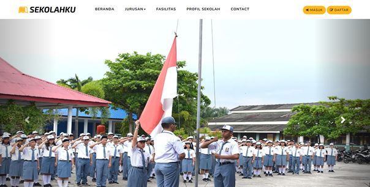

# Sekolahku

Sekolahku merupakan website yang dibuat untuk memberikan informasi seputar sejarah sekolah, visi & misi, jurusan apa saja yang ada di sekolah, fasilitas yang diberikan dan event sekolah. Website ini memiliki 3 Level akun yang tentunya mempunyai hak akses berbeda - beda. Yang pertama untuk Administrator kegunaannya dapat mengkontrol akun, manajemen akun, melihat email yang telah mengirim pesan, dan dapat memanajemen mata pelajaran. Selanjutnya untuk Guru kegunaannya dapat memanajemen nilai murid yang memilih mata pelajarannya. Kemudian untuk Murid mempunyai akses untuk melihat nilai - nilai pada mata pelajaran pilihan mereka yang telah dimanajemen oleh guru pada website Sekolahku. Itulah beberapa hak akses pada masing – masing level, tentunya akan mempermudah dan berguna untuk sekolah - sekolah di Indonesia.

## Fitur
- Manajemen Guru
- Manajemen Murid
- Manajemen Mata Pelajaran
- Manajemen Nilai
- Enkripsi Password (md5)

## Panduan Dan Instalasi
Panduan dan instalasi dapat dilihat dalam file Documentation.pdf

## Akun

| User             |Password                                        | 
| ----------------- | ------------------------------------------------------------------ |
| admin | admin123 |
| Silvia | 101 
| Rizky | 21081010001 |

## Jenis Akun
| User             |Jenis Akun                                        | 
| ----------------- | ------------------------------------------------------------------ |
| admin | Administrator |
| Silvia | Guru 
| Rizky | Murid |

## Hak Akses
| Jenis Akun             | Akses                                                          | 
| ----------------- | ------------------------------------------------------------------ |
| Administrator | Kontrol Akun
||Manajemen Murid
||Manajemen Nilai 
||Email
||Manajemen Mata Pelajaran
| Guru | Manajemen Nilai |
| Murid | Cek Nilai |

## Screenshots

## Tim Kami

- [@adamxrb](https://www.instagram.com/adamxrb/)
- [@yasirfahmi._](https://www.instagram.com/yasirfahmi._)
- [@ryan_reynickha](https://www.instagram.com/ryan_reynickha)
- [@jifasolasido](https://www.instagram.com/jifasolasido)
- [@cintyajuanita](https://www.instagram.com/cintyajuanita)

